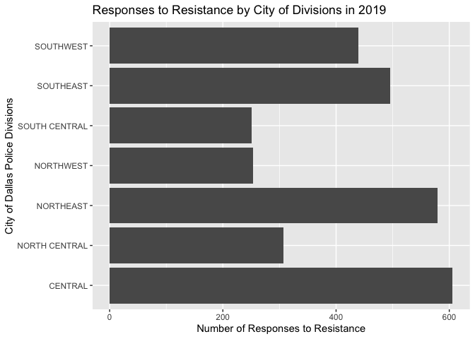
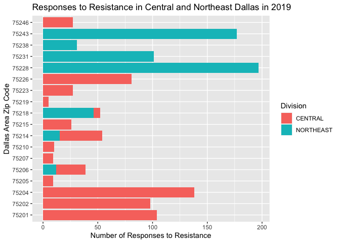
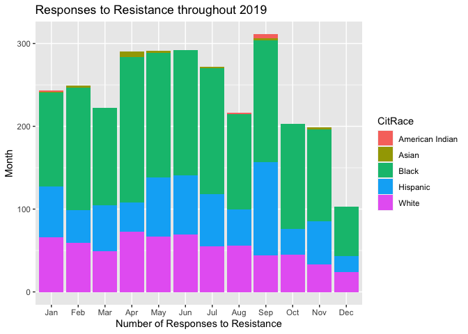
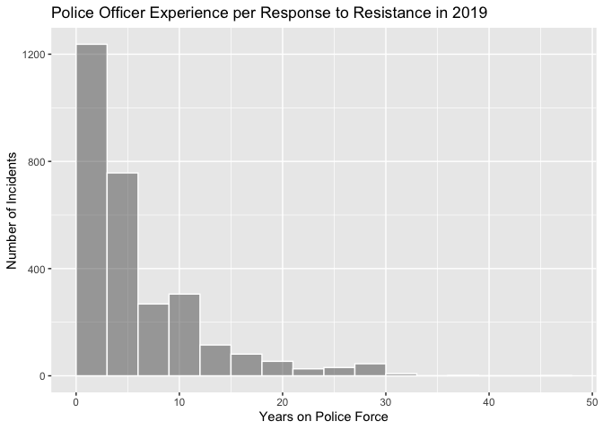

*This a project for Montgomery College's Data Sciene 110 course Fall 2020*

## About the dataset

This dataset comes from Dallas OpenData, a resource providing data published by the City of Dallas (Source: https://www.dallasopendata.com/Public-Safety/Police-Response-to-Resistance-2019/46zb-7qgj).

This dataset explores incidents of Dallas Police Department officers responding to resistance by citizens in the year 2019. Some of the elements in this dataset include details such as the location in the City and descriptions of the officers and citizens involved. The dataset reveals what type of force was used by the officer, the physical condition of both the officers and the citizens, and if anyone was injured. This dataset can help give insight into how Dallas police officers have been handling incidents where citizens resist.

Helpful definitions:

- Resistance: A subject’s failure to comply with an officer’s attempt to establish control.
- Reasonable Force: Tactics and/or techniques objectively sensible for the situation and consistent with what other reasonable officers would do in light of similar circumstances.
- Force: Physical and communicative control tactics and weapons an officer uses to influence the actions of a subject or to protect the subject from injuring himself or others.

Of note, the Dallas Police Department states that they use a "Linear Response-to-Resistance Continuum" as its training model (source: https://dallaspolice.net/reports/Pages/response-resistance.aspx). Each officer decides how to de-escalate resistance during each incident and that can involve using reasonable force.

## Preparing the dataset

To prepare for analysis of this dataset, I loaded the tidyverse, ggplot2, and lubridate libraries. I also set my working directory for this project. I read in the dataset from a csv file and checked that everything imported correctly by looking at the beginning and ending rows. I did not check for missing values at this point but made note that all the columns appear to be formatted correctly.


```r
library(tidyverse)
library(ggplot2)
library(lubridate)

setwd("/Users/benfeard/Desktop/Data Science/Data Science 110/Week 6/Police in the Community Datasets")
policedata <- read_csv("Police_Response_to_Resistance2019Dallas.csv")

head(policedata)
```

```
## # A tibble: 6 x 41
##   OBJECTID   ZIP FILENUM UOFNum OCCURRED_D OCCURRED_T CURRENT_BA OffSex OffRace
##      <dbl> <dbl> <chr>   <chr>  <chr>      <chr>           <dbl> <chr>  <chr>  
## 1     2817 75253 UF2019… 62295… 12/1/2019  10:34 PM        11285 Male   White  
## 2     2234 75208 UF2019… 61093  10/6/2019  12:50 AM        11208 Male   White  
## 3     2755 75231 UF2019… 62820  12/31/2019 11:37 PM         9415 Male   White  
## 4     2110 75228 UF2019… 60990  9/30/2019  6:20 PM          9884 Male   Hispan…
## 5     1663 75051 UF2019… 59592… 8/4/2019   12:10 AM        10480 Male   Hispan…
## 6     2538 75217 UF2019… 62255  11/20/2019 12:30 AM         9697 Male   White  
## # … with 32 more variables: HIRE_DT <chr>, OFF_INJURE <lgl>, OffCondTyp <chr>,
## #   OFF_HOSPIT <lgl>, SERVICE_TY <chr>, ForceType <chr>, UOF_REASON <chr>,
## #   Cycles_Num <chr>, ForceEffec <chr>, STREET_N <dbl>, STREET <chr>,
## #   street_g <chr>, street_t <chr>, Address <chr>, CitNum <dbl>, CitRace <chr>,
## #   CitSex <chr>, CIT_INJURE <lgl>, CitCondTyp <chr>, CIT_ARREST <lgl>,
## #   CIT_INFL_A <chr>, CitChargeT <chr>, `Council District` <chr>, RA <dbl>,
## #   BEAT <dbl>, SECTOR <dbl>, DIVISION <chr>, X <dbl>, Y <dbl>,
## #   GeoLocation <chr>, `Council Districts--Test` <dbl>, `Dallas City Limits GIS
## #   Layer` <dbl>
```

```r
tail(policedata, 2)
```

```
## # A tibble: 2 x 41
##   OBJECTID   ZIP FILENUM UOFNum OCCURRED_D OCCURRED_T CURRENT_BA OffSex OffRace
##      <dbl> <dbl> <chr>   <chr>  <chr>      <chr>           <dbl> <chr>  <chr>  
## 1     1611 75218 UF2019… 56573… 4/10/2019  4:48 AM          8517 Female White  
## 2     2472 75232 UF2019… 59625… 8/4/2019   7:04 PM         10400 Male   White  
## # … with 32 more variables: HIRE_DT <chr>, OFF_INJURE <lgl>, OffCondTyp <chr>,
## #   OFF_HOSPIT <lgl>, SERVICE_TY <chr>, ForceType <chr>, UOF_REASON <chr>,
## #   Cycles_Num <chr>, ForceEffec <chr>, STREET_N <dbl>, STREET <chr>,
## #   street_g <chr>, street_t <chr>, Address <chr>, CitNum <dbl>, CitRace <chr>,
## #   CitSex <chr>, CIT_INJURE <lgl>, CitCondTyp <chr>, CIT_ARREST <lgl>,
## #   CIT_INFL_A <chr>, CitChargeT <chr>, `Council District` <chr>, RA <dbl>,
## #   BEAT <dbl>, SECTOR <dbl>, DIVISION <chr>, X <dbl>, Y <dbl>,
## #   GeoLocation <chr>, `Council Districts--Test` <dbl>, `Dallas City Limits GIS
## #   Layer` <dbl>
```

## Cleaning up the dataset

I decided to make a smaller dataframe using a subset of the columns from the original dataset. The information of interest that I selected includes the zip code where the incident occurred, the date the incident occurred, the date the officer was hired, the race and sex of the citizen involved, and the division of the Dallas where the incident occurred. I renamed several columns to make them easier to understand at first glance. I added a column for the month the incident occurred. Everything occurred in 2019 so I am comfortable ignoring the year. Using all 365 potential days to analyze the data was too granular for observing trends. I converted strings into dates using lubridate. I converted divisions, race, zip codes and months into factors to help with data analysis. I added a final column measuring the amount of time a police officer had been working for the Dallas Police Department up until the incident date.


```r
police_df <- policedata %>% 
        
    select(ZIP, OCCURRED_D, HIRE_DT, CitRace, DIVISION) %>%
    
    rename(zip_code = ZIP, incident_date = OCCURRED_D, hiring_date = HIRE_DT) %>%
    
    mutate(incident_date = mdy(incident_date), hiring_date = mdy(hiring_date),
           CitRace = as.factor(CitRace), CitRace = recode(CitRace, "American Ind" = "American Indian"),
           zip_code = as.factor(zip_code), division = as.factor(DIVISION),
           month = factor(format(incident_date, "%b"), levels = month.abb, ordered = TRUE),
           career_length = interval(hiring_date, incident_date) %/% years(1))
```

## Data analysis and visualization

### 1. Are particular neighborhoods in Dallas, TX being targeted?

I used the zip code and division data to look at a breakdown of areas that experience the most response to resistance incidents. I made a histogram to see which divisions of the city experience the most responses to resistance. The Northeast and Central divisions each responded to over 500 incidents in 2019, more than any other divisions. The Southeast and Southwest divisions were not far behind with over 400 incidents. However, the South Central division was one of the lowest.


```r
division_plot <- police_df %>% 
    drop_na() %>%
    ggplot() + 
    geom_bar(aes(x = division)) +
    coord_flip() + 
    labs(y = "Number of Responses to Resistance", x = "City of Dallas Police Divisions",
    title = "Responses to Resistance by City of Divisions in 2019")
division_plot
```

<!-- -->

Next, I looked at the incidents in the top two divisions based on zip code to see which neighborhoods required police assistance. The 75231 and 75243 zip codes had the most incidents in the Northeast division while the 75204 zip had the most in the Central division.


```r
location_plot <- police_df %>%
    filter(division == "CENTRAL" | division == "NORTHEAST") %>%
    ggplot() + 
    geom_bar(aes(x = zip_code, fill = division)) +
    coord_flip() + 
    labs(y = "Number of Responses to Resistance", x = "Dallas Area Zip Code",
    title = "Responses to Resistance in Central and Northeast Dallas in 2019", fill = "Division")
location_plot
```

<!-- -->

*In a future analysis, I would like to highlight this data on a map of Dallas to better understand how these zip codes are physically clustered together.*

### 2. How many incidents occur in different parts of Dallas throughout the year?

I tried making an alluvial looking at the change in the number of responses to resistance in different divisions of Dallas as function of time. The code to run and view this plot is commented out below but still fully functional. I made a new dataframe to simplify the graphing process and to improve visualization. This dataframe contains the race of the citizen involved in the incident (ignoring those labeled NULL, Other, or Unknown) and the month the incident occurred. The new bar plot with the same data reveals that there are fewer incidents in October through December when the temperatures can reach there lowest (high 30's to 40's Fahrenheit). There is a spike in the number of incidents in September which could be related to the school year starting. There are no discernible trends regarding race and the time of year when the incident occurred. Of note are two regions of the plot, a spike in American Indians being responded to by police in September and Asians in April.


```r
#library(alluvial)

alluvial_df <- police_df %>%
    select(CitRace, month) %>% #select(division, month) %>%
    filter(CitRace != "NULL" & CitRace != "Other" & CitRace != "Unknown") %>%
    drop_na() %>% 
    group_by(month, CitRace) %>% #group_by(month, division) %>%
    summarize(incidents = n()) %>%
    select(CitRace, month, incidents) #select(division, month, incidents)

timeseries_plot <- alluvial_df %>%
    ggplot(aes(x = incidents, y = month, fill = CitRace)) +
    geom_bar(stat = "identity") +
    coord_flip() +
    labs(y = "Number of Responses to Resistance", x = "Month",
    title = "Responses to Resistance throughout 2019")

timeseries_plot
```

<!-- -->

```r
#alluvial_ts(alluvial_df, wave = .3, ygap = 5, grid = TRUE, xlab = "Month", ylab = "Number of Responses to Resistance", border = NA, axis.cex = .8, leg.mode = TRUE, title = "Number of Incidents per Dallas Division in 2019")
```

*A future analysis should explore how the percentages of different races of citizens involved compares to the demographics of Dallas, TX*

### 3. How experienced are the officers handling these situations?

I used the hiring date to determine how many years the officer had been on the police force before responding to a particular incident. I made a histogram to see how experienced officers typically are when responding to resistance by citizens. To make the histogram's appearance cleaner, I grouped the years of experience in clusters of 3 years and I selected the number of bins based on the range of experience in the dataset (0 to 47 years since the hiring date). The majority of police officers had less than 3 years of experience and the next largest group had 3-6 years of experience revealing that often new officers are dealing with resistance.


```r
range(police_df$career_length)
```

```
## [1]  0 47
```

```r
experience_plot <- police_df %>% 
    drop_na() %>%
    ggplot() + 
    geom_histogram(aes(x = career_length), bins = 48, position = "identity", 
                   alpha = 0.5, binwidth = 3, color = "white", boundary = 0) +
    labs(x = "Years on Police Force", y = "Number of Incidents",
    title = "Police Officer Experience per Response to Resistance in 2019")
experience_plot
```

<!-- -->

*A future analysis could explore if the type of force used by the officer is correlated with age.*

## Conclusions

This dataset reveals useful information about how the Dallas Police Department handles incidents of resistance by citizens. I have only done a preliminary analysis to answer a few questions, but more can be gleamed from this dataset.

My analysis suggests that incidents occur primary in the Northeast/Central part of the city and the two southern corners. These incidents are further clustered in specific neighborhoods based on zip codes. While citizens of different races are involved in incidents in consistent ratios throughout the year, there is a noticeable decline in responses as summer ends and the year closes. This brings up questions such as quotas required for police officers. And finally, it is clear that less experience officers are the ones responsible for responding to resistance. This breakdown could help the Dallas Police Department redistribute their assignments throughout the city or could be indicative of how they want to handle cases.
